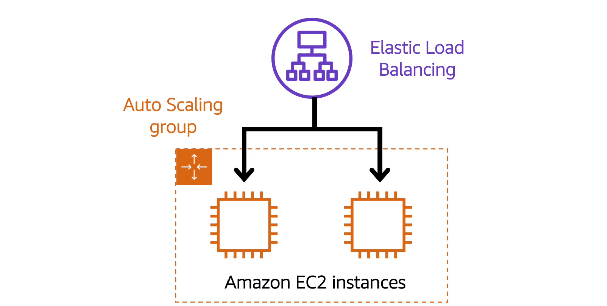

Scalability
Scalability involves beginning with only the resources you need and designing your architecture to automatically respond to changing demand by scaling out or in. As a result, you pay for only the resources you use. You don’t have to worry about a lack of computing capacity to meet your customers’ needs.

If you wanted the scaling process to happen automatically, which AWS service would you use? The AWS service that provides this functionality for Amazon EC2 instances is Amazon EC2 Auto Scaling.

Amazon EC2 Auto Scaling
If you’ve tried to access a website that wouldn’t load and frequently timed out, the website might have received more requests than it was able to handle. This situation is similar to waiting in a long line at a coffee shop, when there is only one barista present to take orders from customers.

Amazon EC2 Auto Scaling enables you to automatically add or remove Amazon EC2 instances in response to changing application demand. By automatically scaling your instances in and out as needed, you are able to maintain a greater sense of application availability.

Within Amazon EC2 Auto Scaling, you can use two approaches: dynamic scaling and predictive scaling.

- Dynamic scaling responds to changing demand.

 - Predictive scaling automatically schedules the right number of Amazon EC2 instances based on predicted demand.
