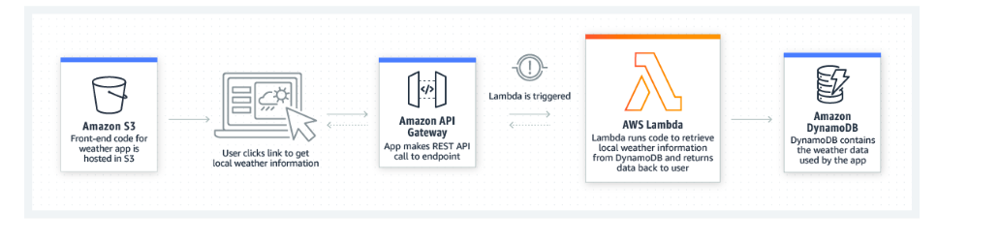
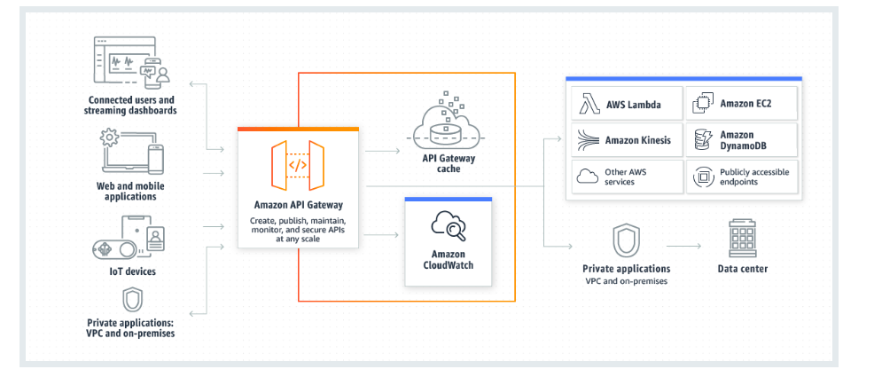

AWS Lambda and Amazon API Gateway
Representational State Transfer (REST)
In a previous lesson on microservices, you were introduced to the concept of REST APIs. REST plays a large part in communication on the internet, and you might hear people talking about RESTful applications or RESTful APIs.

So, what is REST? REST is a set of guidelines that helps different computer systems communicate with each other online. You can think of REST as a universal language for computers. These rules help applications, websites, and other online resources work together smoothly.The following list defines some REST concepts:

Resources: In REST, everything is considered a resource. A resource can be an object, a piece of data, or any information that can be accessed or manipulated.

HTTP methods: REST uses standard HTTP methods (such as GET, POST, PUT, DELETE, and others) to perform actions on resources. These methods correspond to different operations, such as retrieving, creating, updating, or deleting data or resources.

Stateless: Each HTTP request from a client to a server must contain all the information the server needs to understand and fulfill the request. Servers don't retain any client state between requests.

Client-server architecture: REST separates the client (user interface) from the server (data storage and processing). By using this architecture, each component can evolve independently.

For this course, and for a beginner, it’s not necessary that you deeply understand what all these concepts mean at this point. The point of mentioning these concepts is so you can have a high-level understanding of the term when you encounter it in the field or in your studies. The concepts will become clearer as you see more examples.

For more information about REST, see
What Is REST?

AWS Lambda
AWS Lambda is a serverless computing service. You can use Lambda to run code without provisioning or managing servers, which is what makes it serverless. With Lambda, you can run your code in response to events or triggers, such as changes to data in Amazon Simple Storage Service (Amazon S3) buckets, updates to database records, or HTTP requests coming through Amazon API Gateway.

The following diagram shows the flow for an application that hosts static assets for a website out of Amazon S3. Then, as the user interacts with the browser, the application makes an HTTP call to an API that’s hosted in Amazon API Gateway. Amazon API Gateway is the trigger for the Lambda function that’s in the diagram. After API Gateway receives a request, it then invokes the Lambda function, which runs the code. The Lambda function can then complete tasks, such as writing to an Amazon DynamoDB table, for example.

There is no such thing as “Lambda code.” Instead, Lambda functions run your code, and that code is packaged in a way that Lambda understands. Lambda supports various languages and runtimes for functions. For a list of supported runtimes for Lambda, see
Lambda Runtimes
.

For more information about Lambda, see
Lambda Concepts
.

Amazon API Gateway

Amazon API Gateway is a service for creating, publishing, maintaining, monitoring, and securing REST, HTTP, and WebSocket APIs. API developers can create APIs that access AWS or other web services, in addition to data that’s stored in the cloud. As an API Gateway API developer, you can create APIs for use in your own client applications, or you can make your APIs available to third-party application developers.

API Gateway acts as a front door for applications to access data, business logic, or functionality from your backend services. These backend services include workloads that run on Amazon Elastic Compute Cloud (Amazon EC2), code that runs on Lambda, web applications, or real-time communication applications.

The following diagram shows an architecture that uses API Gateway. This diagram illustrates how the APIs you build in API Gateway provide you (or your developer customers) with an integrated and consistent developer experience for building AWS serverless applications. API Gateway handles all the tasks that are involved in accepting and processing up to hundreds of thousands of concurrent API calls. These tasks include traffic management, authorization and access control, monitoring, and API version management.

For more information, see
What Is Amazon API Gateway?

Infrastructure as code (IaC)
A fundamental principle of DevOps is to treat infrastructure the same way developers treat code. Application code has a defined format and syntax. If the developer doesn’t write code according to the rules of the programming language, they won't be able to create applications. Code is also stored in a version management or source control system that logs a history of code development, changes, and bug fixes. When code is compiled or built into applications, developers expect that a consistent application will be created, and that the build is repeatable and reliable.

Practicing infrastructure as code (IaC) means applying the same rigor of application code development to infrastructure provisioning. All configurations should be defined in a declarative way and stored in a source control system—such as
AWS CodeCommit
—in the same way as application code. Infrastructure provisioning, orchestration, and deployment should also support the use of the infrastructure as code.

Infrastructure was traditionally provisioned by using a combination of scripts and manual processes. Sometimes, these scripts were stored in version control systems, or documented step by step in text files or runbooks. Often, the person who wrote the runbooks was not the same person who ran these scripts or followed the runbooks. If these scripts or runbooks weren’t updated frequently, they could potentially stop deployments. As a result, the creation of new environments wasn’t always repeatable, reliable, or consistent.

In contrast, AWS provides a DevOps-focused way of creating and maintaining infrastructure. Similar to the way software developers write application code, AWS provides services that you can use to create, deploy, and maintain infrastructure in a programmatic, descriptive, and declarative way. These services are designed to provide rigor, clarity, and reliability. These AWS services are core to a DevOps methodology, and they support numerous, higher-level AWS DevOps principles and practices.

For more information, see
Infrastructure as Code
.

AWS Serverless Application Model (AWS SAM)
The AWS Serverless Application Model (AWS SAM) is an open-source framework for building serverless applications. It provides shorthand syntax to express functions, APIs, databases, and event source mappings. By writing a few lines per resource, you can define the application you want and model it by using YAML. During deployment, AWS SAM transforms and expands the AWS SAM syntax into AWS CloudFormation syntax, which means that you can build serverless applications faster.

To start building applications based on AWS SAM, use the
AWS SAM CLI
. The AWS SAM CLI provides an execution environment similar to Lambda. You can use the execution environment to locally build, test, and debug applications that are defined by AWS SAM templates or through the AWS Cloud Development Kit (AWS CDK). You can also use the AWS SAM CLI to deploy your applications to AWS, or create secure continuous integration and deployment (CI/CD) pipelines that are designed to follow best practices.

For more information about how to install the AWS SAM CLI, see
 Installing AWS SAM CLI.

AWS SAM consists of two primary parts:

AWS SAM template specification: An open-source framework that you can use to define your serverless application infrastructure on AWS.

AWS SAM command line interface (AWS SAM CLI): A command line tool that you can use with AWS SAM templates and supported third-party integrations to build and run your serverless applications.

To create a new SAM project, use the AWS SAM CLI to run the following command: sam init

For more information about creating a hello world application by using AWS SAM, see
Tutorial: Deploying a Hello World Application
.

To learn more about AWS SAM in general, see
What Is the AWS Serverless Application Model?