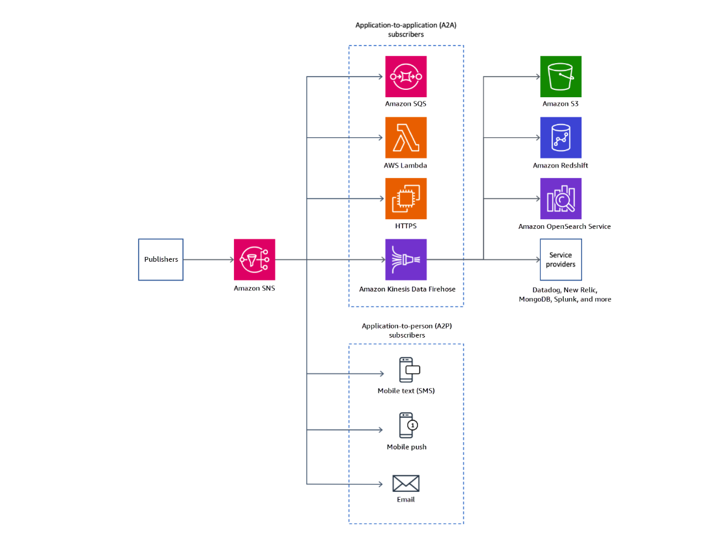
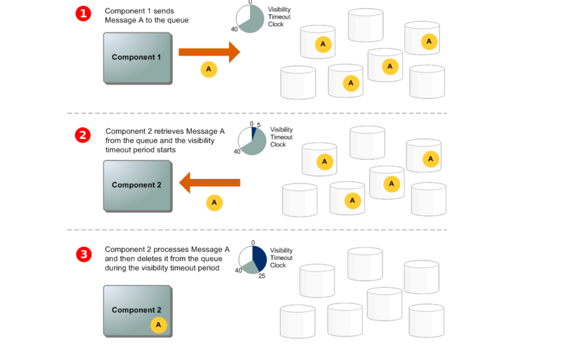
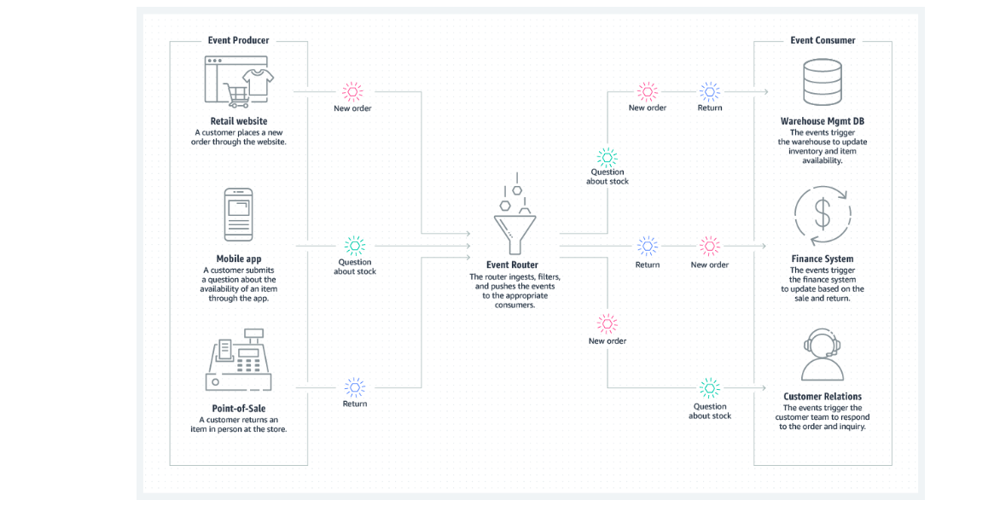
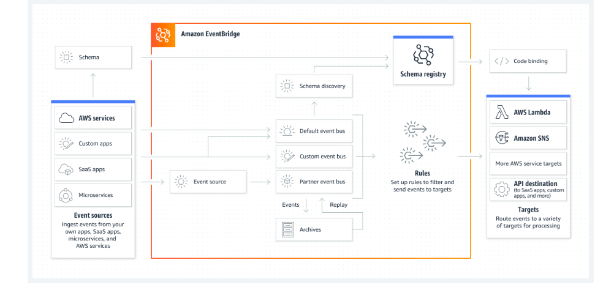

Application integration services
Amazon Simple Notification Service (Amazon SNS)
Amazon Simple Notification Service (Amazon SNS) is a managed service that provides message delivery from publishers to subscribers (also known as producers and consumers). Publishers communicate asynchronously with subscribers by sending messages to a topic, which is a logical access point and communication channel.

Clients subscribe to the SNS topic and receive published messages by using a supported endpoint type, such as Amazon Kinesis Data Firehose, Amazon Simple Queue Service (Amazon SQS), AWS Lambda, HTTP, email, mobile push notifications, and mobile text messages through Short Message Service (SMS). Amazon SNS follows a publish-subscribe (pub-sub) model, where publishers publish messages and subscribers receive messages that they’re interested in.

The following diagram shows both application-to-application and application-to-person use cases for Amazon SNS.

To learn more about Amazon SNS, see
Common Amazon SNS Scenarios.

Amazon Simple Queue Service (Amazon SQS)
Queues are common in many different types of application architectures. Queues follow a point-to-point messaging pattern. In this pattern, message producers send a message to a queue. The message remains in the queue until one of the message producers receives the message and processes it.

The following diagram shows the lifecycle of an Amazon SQS message in a queue, starting with creation and ending with deletion.

A producer (component 1) sends message A to a queue, and the message is distributed across the Amazon SQS servers redundantly.

When a consumer (component 2) is ready to process messages, it consumes messages from the queue, and message A is returned. While message A is being processed, it remains in the queue and isn't returned to subsequent receive requests for the duration of the
visibility timeout
.

The consumer (component 2) deletes message A from the queue to prevent the message from being received and processed again when the visibility timeout expires.

Amazon SQS helps decouple applications by introducing a layer of asynchronous communication through message queues. Asynchronous communication promotes loose coupling, scalability, fault tolerance, and resilience within distributed systems—all of which make it easier to build and manage complex architectures.

For more information about Amazon SQS, see
What Is Amazon SQS?

Event-driven architecture (EDA)
An event-driven architecture (EDA) uses events to trigger and communicate between decoupled services. EDAs are common in modern applications that are built with microservices. An event is a change in state, or an update—such as an item being placed in a shopping cart on an ecommerce website. Events can either carry the state (the item purchased, its price, and a delivery address) or events can be identifiers (a notification that an order was shipped).

EDAs have three key components: event producers, event routers, and event consumers. A producer publishes an event to the router, which filters and pushes the events to consumers. Producer services and consumer services are decoupled, which means that they can be scaled, updated, and deployed independently.

The following diagram is an example of an EDA for an ecommerce site. This architecture enables the site to react to changes from a variety of sources during times of peak demand, without crashing the application or overprovisioning resources.

Amazon EventBridge
Amazon EventBridge is a serverless event bus service that’s used commonly in EDAs. You can use EventBridge to build applications that respond to events from various AWS services, integrated software, custom applications, and external sources. The following list describes some core concepts and components of EventBridge:

Event source: An event source is where the events originate. These sources can be AWS services, such as when a new file is uploaded to Amazon Simple Storage Service (Amazon S3). Sources can also include custom applications that send events to EventBridge for processing.

Event bus: An event bus is a central hub where events are collected and delivered to their target. You can think of it as a communication channel that holds and routes events to different parts of the application. EventBridge supports both default event buses and custom event buses.

Event rules: Event rules define the conditions that determine when an event should be sent from the event bus to a target. You can use event rules to specify filtering criteria for events so that only the relevant events initiate actions.

Targets: Targets are the AWS resources or custom applications that react to events. When the event bus receives an event that matches the conditions defined in an event rule, EventBridge forwards that event to the associated target for processing.

Event patterns: Event patterns are used within event rules to filter events based on specific attributes or values. These patterns help you define the criteria for which events are triggers for the rule.

Event archive: EventBridge can store a copy of every event that passes through the event bus if you need event copies for auditing, compliance, and analysis. You can configure this feature to archive events for a certain period.

Event replay: With event replay, you can replay past events from your archive into an event bus. This feature is useful for testing and debugging. It’s also useful for scenarios where you need to re-create the state of your system at a specific time.

The following diagram shows a basic outline for EventBridge. It includes event sources, which create events and post them to an event bus. After an event enters the event bus, it’s evaluated to see if it matches any rules. If a rule is met, the corresponding targets receive a copy of the message to process.

