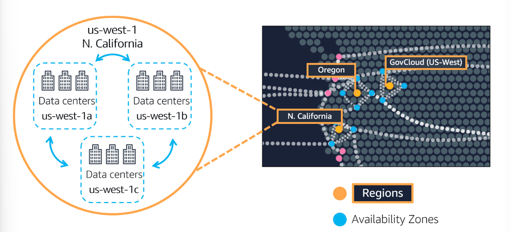
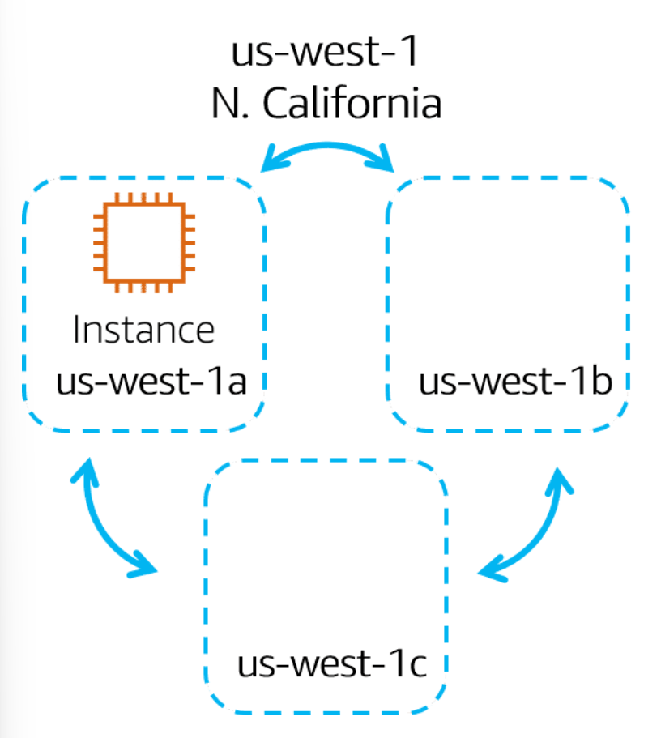
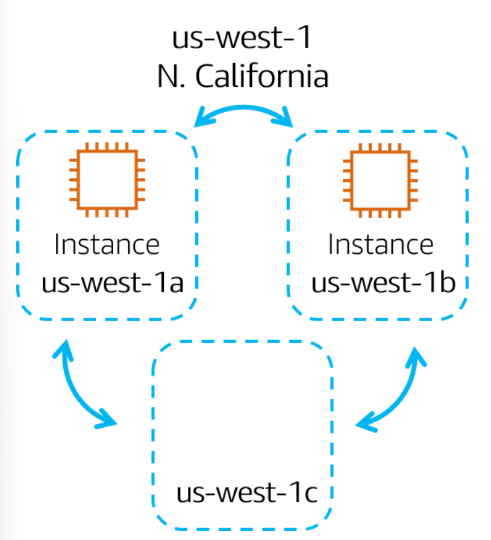
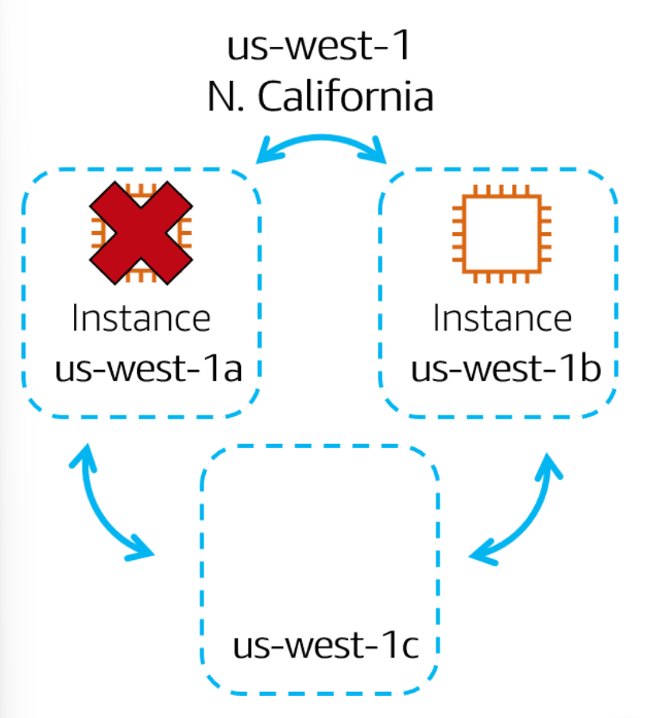

## Availability Zones

An Availability Zone is a single data center or a group of data centers within a Region. Availability Zones are located tens of miles apart from each other. This is close enough to have low latency (the time between when content requested and received) between Availability Zones. However, if a disaster occurs in one part of the Region, they are distant enough to reduce the chance that multiple Availability Zones are affected.

Running Amazon EC2 instances in multiple Availability Zones
Amazon EC2 instance in a single Availability Zone

Suppose that you’re running an application on a single Amazon EC2 instance in the Northern California Region. The instance is running in the us-west-1a Availability Zone. If us-west-1a were to fail, you would lose your instance.

Amazon EC2 instances in multiple Availability Zones

A best practice is to run applications across at least two Availability Zones in a Region. In this example, you might choose to run a second Amazon EC2 instance in us-west-1b.

Availability Zone failure

If us-west-1a were to fail, your application would still be running in us-west-1b.