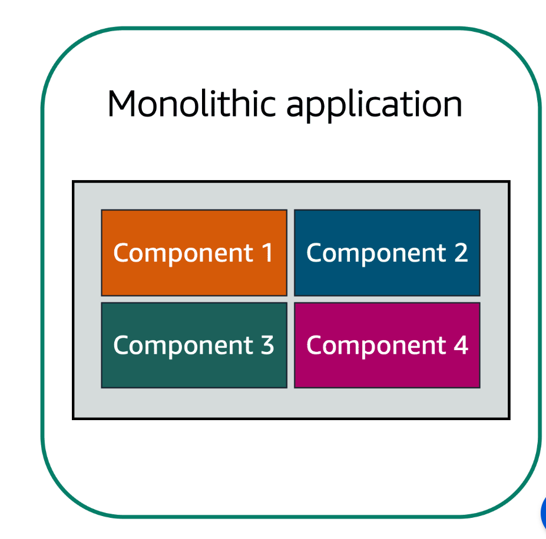

Monolithic Applications and Microservices
Monolithic Applications
Applications are made of multiple components. The components communicate with each other to transmit data, fulfill requests, and keep the application running.

Suppose that you have an application with tightly coupled components. These components might include databases, servers, the user interface, business logic, and so on. This type of architecture can be considered a monolithic application.

In this approach to application architecture, if a single component fails, other components fail, and possibly the entire application fails.

Microservices
To help maintain application availability when a single component fails, you can design your application through a microservices approach.

In a microservices approach, application components are loosely coupled. In this case, if a single component fails, the other components continue to work because they are communicating with each other. The loose coupling prevents the entire application from failing.

When designing applications on AWS, you can take a microservices approach with services and components that fulfill different functions. Two services facilitate application integration: Amazon Simple Notification Service (Amazon SNS) and Amazon Simple Queue Service (Amazon SQS).