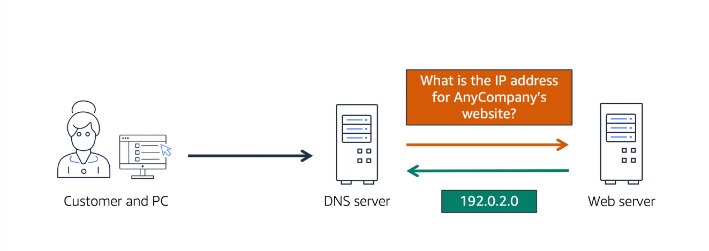
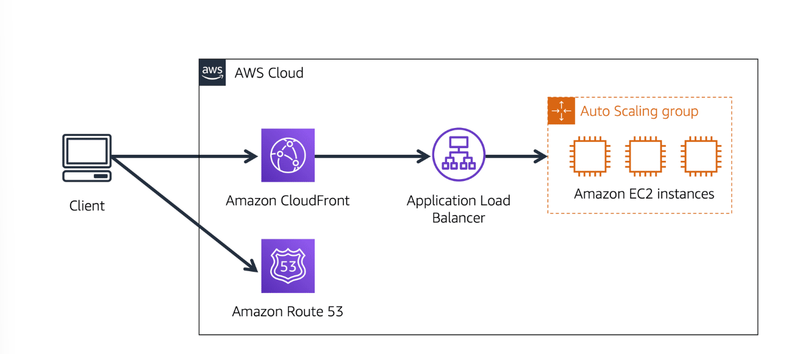

Global Networking
Domain Name System (DNS)
Suppose that AnyCompany has a website hosted in the AWS Cloud. Customers enter the web address into their browser, and they are able to access the website. This happens because of Domain Name System (DNS) resolution. DNS resolution involves a DNS server communicating with a web server.

You can think of DNS as being the phone book of the internet. DNS resolution is the process of translating a domain name to an IP address.

For example, suppose that you want to visit AnyCompany’s website.

When you enter the domain name into your browser, this request is sent to a DNS server.

The DNS server asks the web server for the IP address that corresponds to AnyCompany’s website.

The web server responds by providing the IP address for AnyCompany’s website, 192.0.2.0.

Amazon Route 53
Amazon Route 53
 is a DNS web service. It gives developers and businesses a reliable way to route end users to internet applications hosted in AWS.

Amazon Route 53 connects user requests to infrastructure running in AWS (such as Amazon EC2 instances and load balancers). It can route users to infrastructure outside of AWS.

Another feature of Route 53 is the ability to manage the DNS records for domain names. You can register new domain names directly in Route 53. You can also transfer DNS records for existing domain names managed by other domain registrars. This enables you to manage all of your domain names within a single location.

In the previous module, you learned about Amazon CloudFront, a content delivery service. The following example describes how Route 53 and Amazon CloudFront work together to deliver content to customers.

Example: How Amazon Route 53 and Amazon CloudFront deliver content

Suppose that AnyCompany’s application is running on several Amazon EC2 instances. These instances are in an Auto Scaling group that attaches to an Application Load Balancer.

A customer requests data from the application by going to AnyCompany’s website.

Amazon Route 53 uses DNS resolution to identify AnyCompany.com’s corresponding IP address, 192.0.2.0. This information is sent back to the customer.

The customer’s request is sent to the nearest edge location through Amazon CloudFront.

Amazon CloudFront connects to the Application Load Balancer, which sends the incoming packet to an Amazon EC2 instance.

Resources
To learn more about the concepts that were explored in Module 4, review these resources.

Networking and Content Delivery on AWS

AWS Networking & Content Delivery Blog

Amazon Virtual Private Cloud

What is Amazon VPC?

How Amazon VPC works