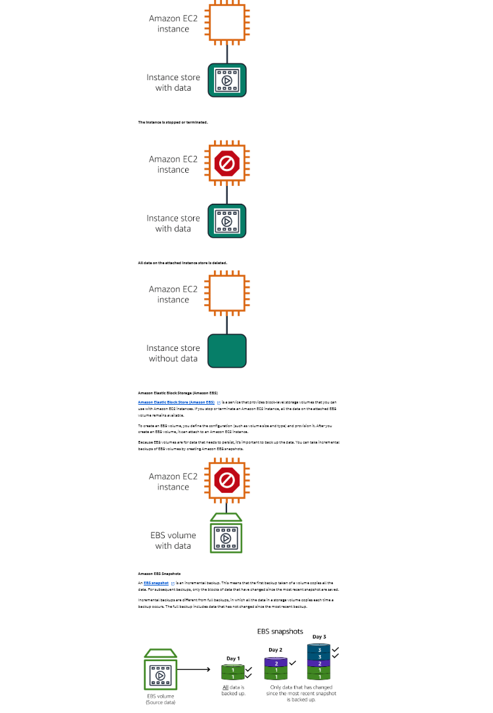

Instance Stores and Amazon Elastic Block Store (Amazon EBS)
Instance stores
Block-level storage volumes behave like physical hard drives.

An
instance store
 provides temporary block-level storage for an Amazon EC2 instance. An instance store is disk storage that is physically attached to the host computer for an EC2 instance, and therefore has the same lifespan as the instance. When the instance is terminated, you lose any data in the instance store.

